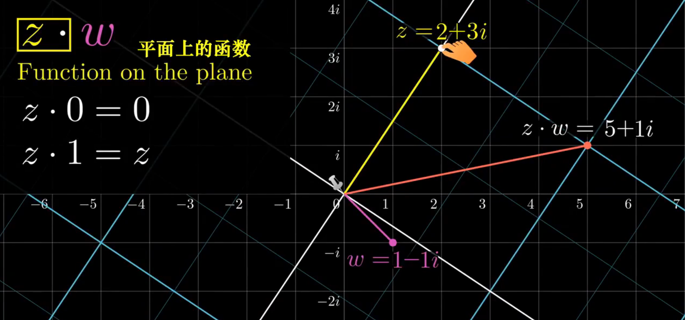

# 欧拉角、矩阵、四元数

# 欧拉角

欧拉角是描述三维空间中物体姿态的一种方式。它由三个角度组成，通常分别称为俯仰角、偏航角和翻滚角。这些角度指定了一个旋转顺序，通常是先绕 Z 轴（偏航），然后是 X 轴（俯仰），最后是 Y 轴（翻滚）。

## 为什么会产生死锁

- 欧拉角描述的是旋转后的结果，而非过程，所以势必旋转顺序问题。

在Unity中，欧拉角的旋转顺序默认是ZXY。如果使用该旋转顺序，会导致类似于上述描述的死锁问题。因此，需要在代码中指定正确的旋转顺序，以避免死锁的发生。


<video src=".\euler.mp4"></video>

平衡环架构是个机械上的结构，所以制作上肯定会存在前面旋转的轴不跟着后面的轴运动，那虚拟空间软件中为什么也这样？

## 数学上的解释
$$
R_x(\alpha) =
\begin{pmatrix}
1 && 0 && 0 \\
0 && cos(\alpha) && -sin(\alpha)\\
0 && sin(\alpha) && cos(\alpha) \\
\end{pmatrix}
\\
R_y(\beta) =
\begin{pmatrix}
cos(\beta) && 0 && sin(\beta)\\
0 && 1 && 0 \\
-sin(\beta) && 0 && cos(\beta) \\
\end{pmatrix}\\
R_z(\theta) =
\begin{pmatrix}
cos(\theta)  && -sin(\theta) && 0\\
sin(\theta)  && cos(\theta) && 0 \\
0 && 0 && 1
\end{pmatrix}\\

R_y(\beta)R_x(\alpha)R_z(\theta)=
\begin{pmatrix}
cos(\beta)cos( \theta)+sin(\alpha)sin(\beta)sin( \theta) && -cos(\beta)sin( \theta)+sin(\alpha)sin(\beta)cos( \theta) && cos(\alpha)sin(\beta)
\\
cos(\alpha)sin(\theta) && cos(\alpha)cos(\theta) && -sin(\alpha)\\

-sin(\beta)cos( \theta)+cos(\beta)sin(\alpha)sin( \theta) && sin( \theta)sin(\beta)+cos(\beta)sin(\alpha)cos(\theta) && cos(\alpha)cos(\beta)\\

\end{pmatrix}\\
当\alpha=\pi/2时 ,
R_y(\beta)R_x(\pi/2)R_z(\theta)=
\begin{pmatrix}
cos(\beta)cos( \theta)+sin(\beta)sin( \theta) && -cos(\beta)sin( \theta)+sin(\beta)cos( \theta) && 0
\\
0 && 0 && -1\\

-sin(\beta)cos( \theta)+cos(\beta)sin( \theta) && sin( \theta)sin(\beta)+cos(\beta)cos(\theta) && 0\\

\end{pmatrix}\\
=\begin{pmatrix}\\
cos(\beta-\theta) && sin(\beta-\theta) && 0\\
0 && 0 && -1\\
-sin(\beta-\theta) && cos(\beta+\theta) && 0\\
\end{pmatrix}\\

=R_x(\pi/2)R_z(\theta-\beta)
$$

通过数学计算发现，Y轴的旋转不见了，死锁发生。

## 更容易的解释

- 欧拉角描述的是旋转后的结果，而非过程。
- 欧拉角描述的是旋转后的结果，而非过程。
- 欧拉角描述的是旋转后的结果，而非过程。
  
    
  
1. (0,0,0)旋转姿态
2. 沿着Y轴旋转到100度
3. 沿着X轴旋转到161度(此时 Y轴已经旋转完成了，所以可以认为Y轴方向已经不会跟着旋转了)
4. 沿着Z轴旋转到60度(同理，X/Y轴并不会参与此次旋转)

最终的结果同平衡环架构。

在欧拉角的实现中，万向轴死锁是不可避免的。所以引入四元数的概念。

# 四元数

四元数是一种数学工具，用于表示三维空间中的旋转。它由一个实部和三个虚部组成，通常写成 q = w + xi + yj + zk 的形式。

其中，w 是实部，x, y, z 是虚部，i, j, k是基向量。

参考资料：

- [维基百科：四元数](https://zh.wikipedia.org/wiki/%E5%9B%9B%E5%85%83%E6%95%B0)
- [Quaternions and 3D Rotation, Explained Intuitively](https://eater.net/quaternions)

## 从最简单的复数说起

`q = w + xi `

### 虚数的定义


数轴的正方向可以绕原点旋转，那就相当于进行2次逆时针旋转90度以后，得到负方向。

```
(+1) * (旋转90度) * (旋转90度) = (-1)
(旋转90度)^2 = -1
把 旋转90度 假设成 i：
i^2 = -1
这个就回推到虚数的定义了。
```

<font color=red> 所以 i 不是一个数字，他代表旋转量。</color>

#### 


将实数轴看作横轴，虚数轴看作纵轴，就构成了一个二维平面。

旋转到某一个角度的任何正实数，必然唯一对应这个平面中的某个点。

只要确定横坐标和纵坐标，比如( 1 , i )，就可以确定某个实数的旋转量（45度）。

[https://eater.net/quaternions](https://eater.net/quaternions)


### 虚数的乘法意义


任何复数 a + bi，都可以改写成旋转半径 r 与横轴夹角 θ 的形式

假定现有两个复数 a + bi 和 c + di，可以将它们改写如下：
$$
A = a + bi = r1 * (cos(\alpha) + i*sin(\alpha))\\
B = c + di = r2 * (cos(\beta) + i*sin(\beta))\\

A * B = r1 * r2  * (cos(\alpha) + i*sin(\alpha))* (cos(\beta) + i*sin(\beta))\\
= r1 * r2  * cos(\alpha) * cos(\beta) - sin(\alpha) * sin(\beta) + i * (cos(\alpha) * sin(\beta) + sin(\alpha) * cos(\beta))\\
== r1 * r2  * (cos(\alpha + \beta) + i * sin(\alpha + \beta))
$$
得到两个复数相乘，相当于旋转半径相乘、<font color=yellow>旋转角度相加</font>。





# 变换矩阵

Unity中使用 4x4 的矩阵来描述 物体的旋转、平移、缩放

## 平移

$$
M = \begin{bmatrix}
1 & 0 & 0 & T_x\\
0 & 1 & 0 & T_y\\
0 & 0 & 1 & T_z\\
0 & 0 & 0 & 1\\
\end{bmatrix}
$$

## 缩放

$$
M = \begin{bmatrix}
S_x & 0 & 0 & 0\\
0 & S_y & 0 & 0\\
0 & 0 & S_z & 0\\
0 & 0 & 0 & 1\\
\end{bmatrix}
$$

## 旋转

$$
R_x(\alpha) =
\begin{pmatrix}
1 & 0 & 0 & 0\\
0 & cos(\alpha) & -sin(\alpha)&0\\
0 & sin(\alpha) & cos(\alpha)&0 \\
0 & 0&0&1
\end{pmatrix}
\\
R_y(\beta) =
\begin{pmatrix}
cos(\beta) & 0 & sin(\beta)&0\\
0 & 1 & 0&0 \\
-sin(\beta) & 0 & cos(\beta) &0\\
0 & 0&0&1
\end{pmatrix}\\
R_z(\theta) =
\begin{pmatrix}
cos(\theta)  & -sin(\theta) & 0&0\\
sin(\theta)  & cos(\theta) & 0&0 \\
0 & 0 & 1&0\\
0 & 0&0&1
\end{pmatrix}\\
$$


P.S. 为什么是4x4的矩阵? 

# 比较

| 行为                           | 旋转矩阵                       | 欧拉角         | 四元数                           |
| ------------------------------ | ------------------------------ | -------------- | -------------------------------- |
| 坐标系变化                     | 能                             | 不能           | 不能                             |
| 增量旋转                       | 能，但比四元数慢，小心矩阵蠕变 | 不能           | 能，快                           |
| 差值                           | 不能                           | 能，可能万向锁 | Slerp                            |
| 易用程度                       | 难                             | 易             | 难                               |
| 内存中占用                     | 9个数                          | 3个数          | 4个数                            |
| 对于给定方位，表达方式是否唯一 | 唯一                           | 无数种         | 2种                              |
| 可能导致非法                   | 矩阵蠕变                       | 合法           | 可能出现误差累积，造成四元数非法 |

欧拉角最容易使用。当需要为世界中的物体指定方位时,欧拉角能大大的简化人机交互,

包括直接的键盘输入方位、在代码中指定方位(如为渲染设定摄像机)、在调试中测试。

如果需要在坐标系之间转换向量,优先选择矩阵形式。

当需要大量保存方位数据(如:动画)时,就使用欧拉角或四元数。欧拉角将少占用25%的内存,但它在转换到矩阵时要稍微慢一些。如果动画数据需要嵌套坐标系之间的连接,四元数可能是最好的选择。

平滑的插值只能用四元数完成。如果你用其他形式,也可以先转换到四元数然后再插值,插值完毕后再转换回原来的形式。